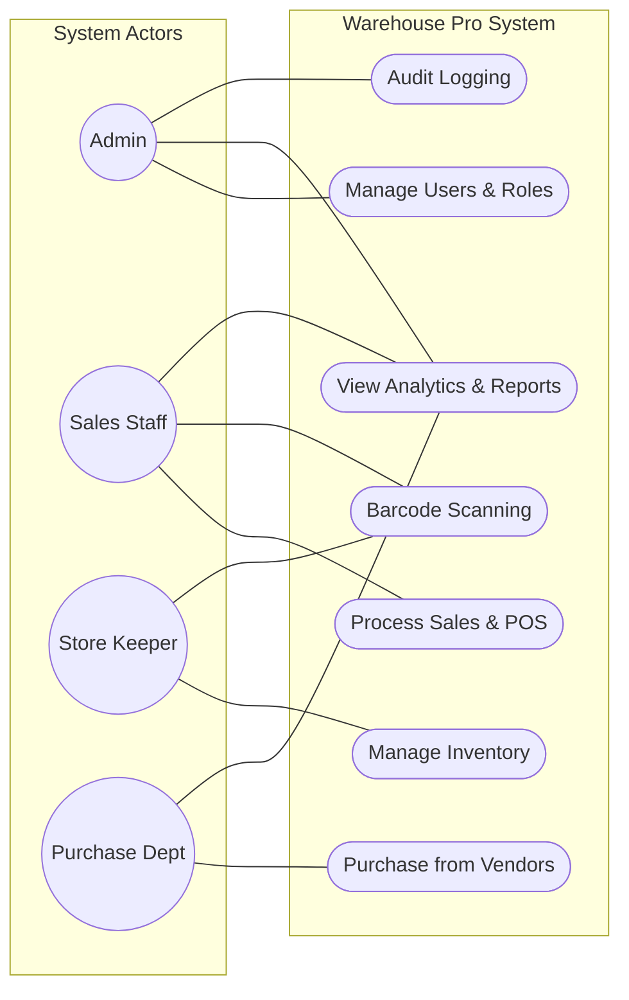
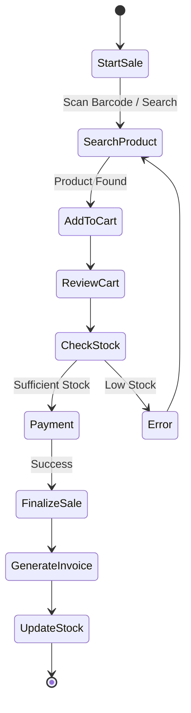
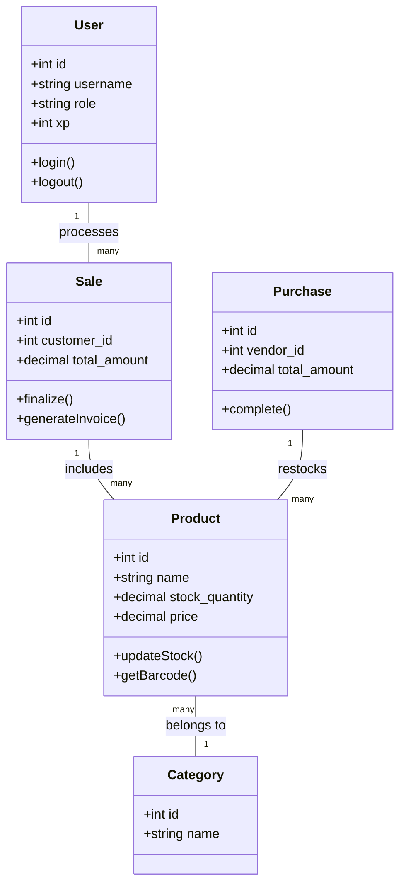
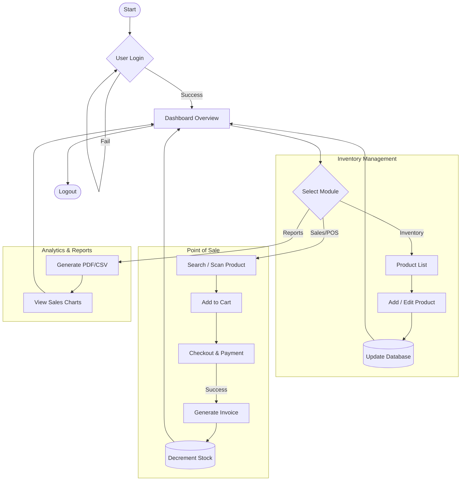
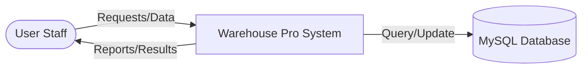
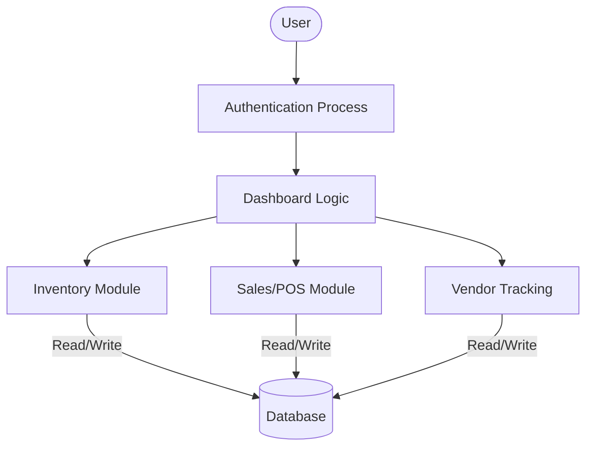
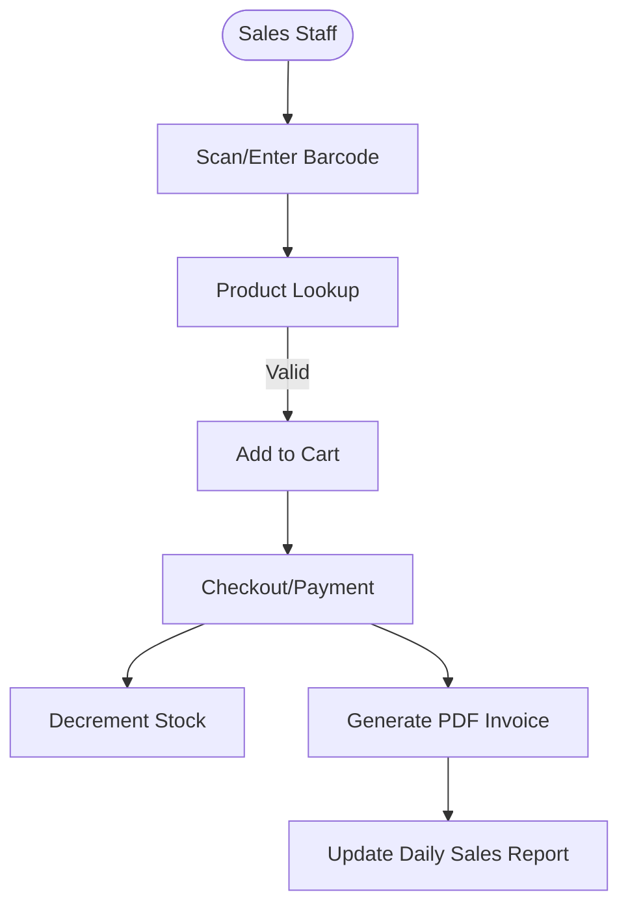
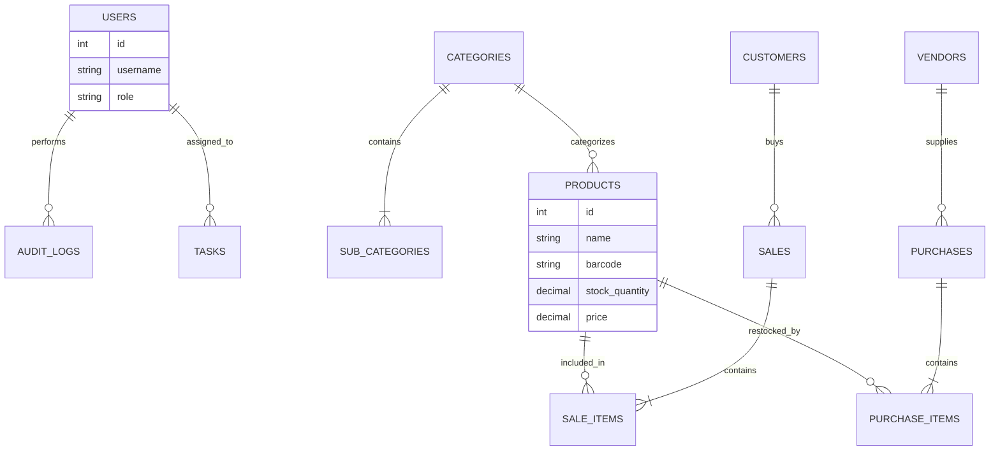
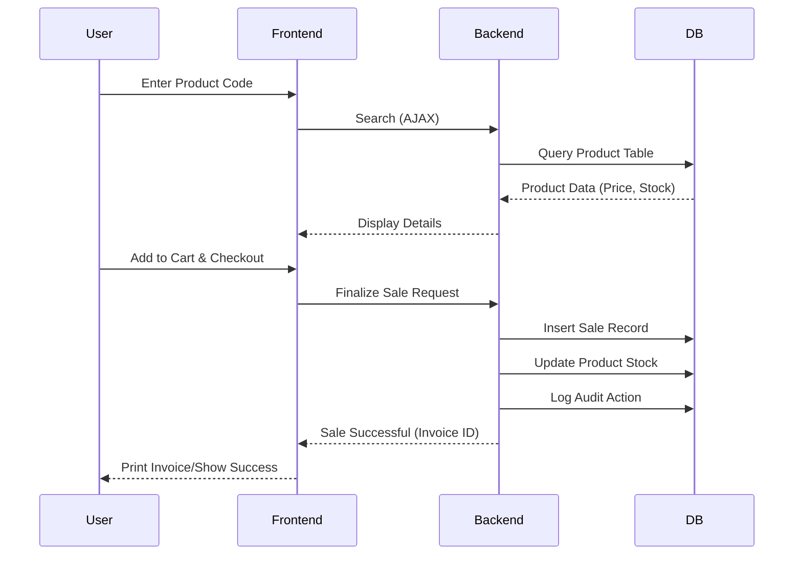
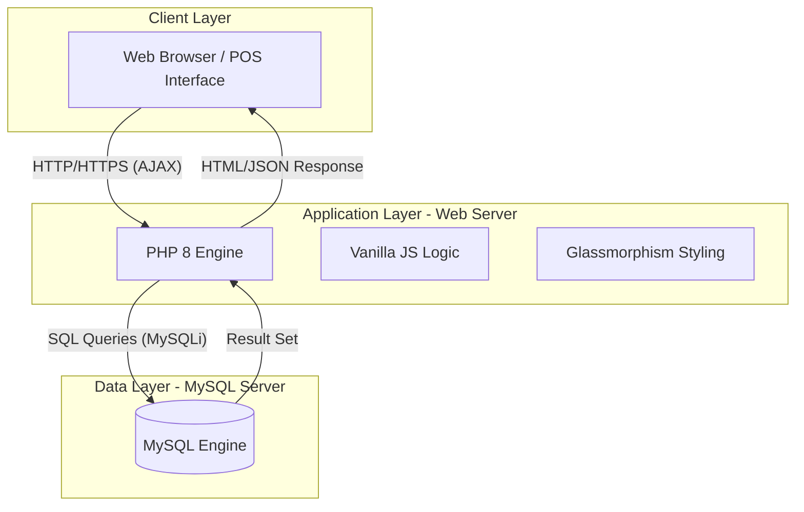

# WAREHOUSE PRO: INVENTORY MANAGEMENT SYSTEM - PROJECT REPORT

## 1. Project Profile & Company Profile

### Project Profile
* **Project Name**: Warehouse Pro
* **Category**: Inventory and Resource Management
* **Platform**: Web-based (PHP 8 + MySQL)
* **Status**: Elite Version (v1.5.0)
* **Developer**: Portfolio Internship Project 2026

### Company Profile
Warehouse Pro is a modern, modular software solution designed to streamline warehouse operations. Our focus is on visual aesthetics (Glassmorphism), real-time data tracking, and role-based operational efficiency. The system is designed to handle high-volume inventory, point-of-sale operations, and vendor procurement lifecycle.

---

## 2. Introduction to Tools & Technology Stack

### Backend Technology
* **PHP 8 (Modular MVC-lite Architecture)**: Used for core business logic, session handling, and server-side processing.
* **MySQLi**: Relational database for efficient data storage and relational integrity.

### Frontend Technology
* **HTML5/CSS3**: Core structure and design.
* **Vanilla JavaScript (ES6+)**: AJAX-based search, dynamic cart management, and interactive UI.
* **Modern CSS Techniques**: Glassmorphism, CSS Grids, and Flexbox for a premium experience.

### Libraries & Integration
* **Chart.js**: Real-time sales and inventory analytics visualizations.
* **FullCalendar**: Integrated event and warehouse task management.
* **JsBarcode**: On-the-fly barcode generation for inventory tracking.
* **Flatpickr**: Modern date/time picker for streamlined data entry.

---

## 3. System Study (Requirement Analysis)

### 3.1 Existing System
The traditional system involves manual ledger entries or basic, non-integrated spreadsheet tracking.
* **Drawbacks**: Human errors, data redundancy, lack of real-time reporting, and difficulty in multi-user synchronization.

### 3.2 Proposed System
"Warehouse Pro" provides a centralized, web-based platform with real-time stock updates.
* **Benefits**: 100% data accuracy, automated invoice generation, role-based access control, barcode integration, and integrated business analytics.

### 3.3 Scope of the Proposed System
The system covers inventory tracking, sales (POS), procurement tracking, audit logging, and comprehensive reports. It aims to reduce manual workload by 70% and improve decision-making through live analytics.

### 3.4 Aims and Objectives
* Automate the warehouse lifecycle from procurement to sale.
* Provide interactive dashboards for business health at a glance.
* Ensure data security through structured Role-Based Access Control (RBAC).

### 3.5 Feasibility Study
* **Operational**: Highly intuitive glassmorphism UI makes it easy for staff with minimal training to operate.
* **Technical**: Built on the robust LAMP/XAMPP stack, ensuring 99.9% uptime on standard servers.
* **Economic**: Low maintenance cost and high efficiency lead to a significant ROI for warehouse owners.

---

## 4. System Analysis

### 4.1 Requirements Specification

#### Functional Requirements:
1. **User Management**: RBAC for Admin, Product, Purchase, Sell, and Inventory departments.
2. **Product Management**: CRUD with barcode, batch tracking, and expiry handling.
3. **Sales Processing (POS)**: Customer lookup, AJAX searching, and automated invoicing.
4. **Procurement**: Tracking incoming items from vendors and updating stock automatically.
5. **Analytics**: Real-time charts for sales, profit, and top products.

#### Non-Functional Requirements:
1. **Performance**: Page load < 1s under standard conditions.
2. **Security**: Password hashing and session-based auth.
3. **Usability**: Responsive design for tablets and desktops.

### 4.2 Use Case Diagram

### 4.3 Activity Diagram (Process Flow: New Sale)

### 4.4 Class Diagram / System Flowchart

#### Class Diagram

#### System Flowchart

### 4.5 Data Flow Diagram (Context Level)

#### First Level DFD

#### Second Level DFD (Sales POS)

### 4.6 ER Diagram

### 4.7 Sequence Diagram: Processing a Sale

### 4.8 System Architecture Diagram

---

## 5. System Design

### 5.1 Data Dictionary

| Table | Purpose | Primary Key | Foreign Key(s) |
|---|---|---|---|
| `users` | Store user credentials and roles | `id` | - |
| `products` | Core inventory item details | `id` | `category_id`, `sub_category_id` |
| `categories` | Categorization for products | `id` | - |
| `sales` | Sale transaction headers | `id` | `customer_id` |
| `sale_items` | Individual items in a sale | `id` | `sale_id`, `product_id` |
| `vendors` | Supplier contact information | `id` | - |
| `audit_logs` | Tracking all system activity | `id` | `user_id` |

### 5.2 Screen Layouts / UI Design
The system uses a **Glassmorphism design language** characterized by:
* Semi-transparent, blurred backdrops for cards and sidebars.
* Vibrant accent colors (gradients) for primary actions.
* Responsive layouts that adapt to inventory management on desktops and POS on smaller touchscreens.

### 5.3 Reports
* **Inventory Summary**: Real-time stock counts and low-stock alerts.
* **Sales Analytics**: Daily revenue, profit margins, and customer trends.
* **Audit Trails**: Security logs showing who modified which product or finalized which sale.

---

## 6. System Implementation

### 6.1 Module Implementation
1. **Modules**: Modular PHP files (e.g., `modules/inventory`, `modules/sell`) allow for clean separation of concerns.
2. **AJAX Actions**: Asynchronous requests in `actions/` ensure a snappy, modern feel without full-page reloads.
3. **Database Integration**: Centralized database connection in `includes/db.php`.

---

## 7. System Testing

### 7.1 Testing Strategies
* **Unit Testing**: Testing individual CRUD functions for products and users.
* **Integration Testing**: Ensuring stock decreases correctly when a sale is finalized.
* **Security Testing**: Verifying RBAC prevents unauthorized access to the Admin panel.

### 7.2 Test Cases
1. **Case 1**: User attempts to sell a product with 0 stock -> **Expected**: System shows "Insufficient Stock" alert.
2. **Case 2**: Admin updates global tax rates -> **Expected**: All new invoices reflect updated CGST/SGST immediately.
3. **Case 3**: Incorrect password login -> **Expected**: Access denied with sound alert/vibration error.

---

## 8. Future Enhancements
* **AI Product Recommendations**: Predicting next month's demand based on historical seasonal trends.
* **Multi-Warehouse Sync**: Synchronized inventory across geographically distant locations.
* **Progressive Web App (PWA)**: Support for offline stock taking via the `manifest.json` and service worker (`sw.js`).

---

## 9. Bibliography/References
* Official PHP Documentation (php.net)
* Mermaid.js documentation for diagramming.
* Chart.js and FullCalendar APIs.

---

## 10. Internal Guide's Report
(Space reserved for Evaluator's Comments and Sign-off)
